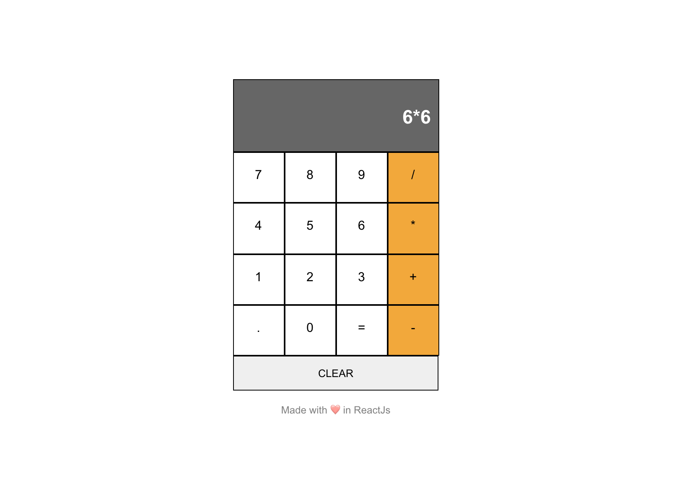

# CALCULATOR APP

It is a solution to the Coding Ninjas CareerCamp React test. Please visit the Coding Ninjas career camp website [CodingNinjas CareerCamp](https://careercamp.codingninjas.com/?utm_source=codingninjas&utm_medium=top_navigation&utm_campaign=landing_header) for more details.

## Table of contents

- [Overview](#overview)
  - [Screenshot](#screenshot)
  - [Links](#links)
- [My process](#my-process)
  - [Built with](#built-with)
  - [What I learned](#what-i-learned)
  - [Useful resources](#useful-resources)
- [Author](#author)
- [Acknowledgments](#acknowledgments)

## Overview

It is a calculator app made in React JS where you can do the basic functionalities of a simple calculator.

### Screenshot



### Links

- Live Site URL: [Live Website](https://kurosakicoder.github.io/ReactCalculator/)

## My process

First, I made the input eval function work which evaluates the digits with JSX. Then I started designing the app with Vanilla CSS.

### Built with

- JSX
- CSS
- React JS

### What I learned

I learn how to concatenate string values using react hooks.

```js
const handleDigits = (val) => {
  setValue(value + val);
};
```

### Useful resources

- [JavaScript eval() Function](https://www.w3schools.com/jsref/jsref_eval.asp)

## Author

- LinkedIn - [Khaidem Sandip Singha ](https://www.linkedin.com/in/khaidemsandip/)
- Twitter - [@KurosakiCoder](https://twitter.com/KurosakiCoder)

## Acknowledgments

I have done this project from scratch by referencing the websites that I mentioned.
